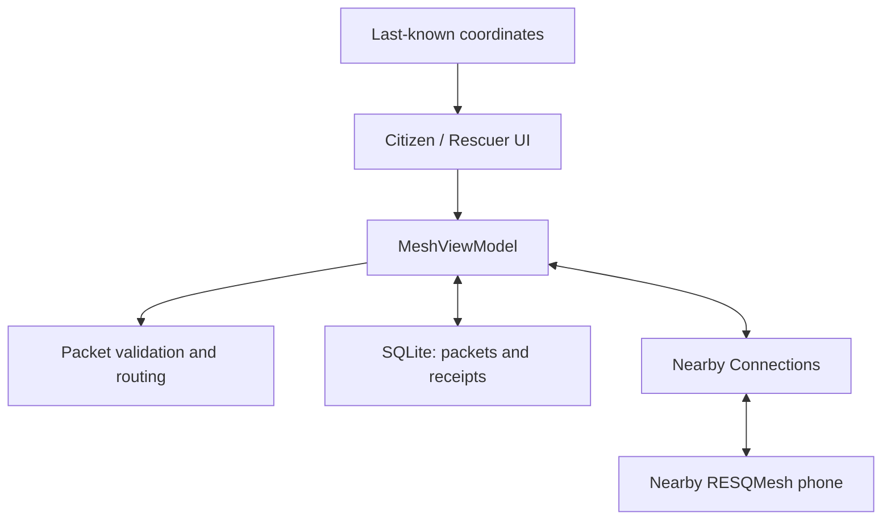

# RESQMesh

**Communication when networks fail.**

Android disaster communication prototype. Nearby phones exchange emergency SOS packets over local radios, save them, and forward them when another participating phone connects.

> **Verification status:** Android debug build succeeds; 15 automated tests pass (13 protocol + 2 SQLite persistence tests). Lint has zero errors and three warnings. A signed debug APK is generated. Physical three-phone networking and visual phone testing are still required. GitHub writes remain blocked by automatic approval review. See [verification status](docs/VERIFICATION.md).

## Problem and why it matters

Disasters can interrupt mobile networks while people's phones still work. Someone trapped may need to share their location, the number of people, and injury information with rescuers. A relay phone can carry a saved SOS beyond the sender's immediate radio range as people move.

## Solution

RESQMesh provides Citizen Mode for creating SOS messages and Rescuer Mode for reviewing them. Both modes participate in forwarding. There is no registration, backend, Supabase, Firebase, or cloud delivery path.

**Every participating phone needs this app installed in advance.** A phone without RESQMesh does not join automatically. Rescuer Mode is a UI mode, not a verified rescue-service identity.

This is application-level store-and-forward over local peer-to-peer links. It is not an operating-system mesh router and does not restore internet access. Users connect nearby nodes and compare pairing codes; queued packets then forward automatically. The MVP operates while the app is visible.

## Technology choice

| Option | MVP decision |
|---|---|
| Nearby Connections, P2P_CLUSTER | Chosen: offline local discovery, encrypted links and multiple peers; suitable for small SOS payloads. Requires Google Play services. |
| Raw Bluetooth/BLE | Avoided for this sprint: more work for reliable framing, pairing, fragmentation and Android radio differences. |
| Wi-Fi Direct | Viable alternative, but group-owner lifecycle adds work to sequential relay connections. |
| Wi-Fi Aware | Not universally available on ordinary Android hardware. |
| Website | Insufficient for the required native phone-to-phone transport and lifecycle access. |

No physical-device evidence is claimed for this choice. Nearby's API supports the scenario, but each team's actual phones must be tested. No fixed range or guaranteed delivery is promised.

References: [Nearby overview](https://developers.google.com/nearby/connections/overview), [cluster strategy](https://developers.google.com/nearby/connections/strategies), [connection verification](https://developers.google.com/nearby/connections/android/manage-connections), [permissions](https://developers.google.com/nearby/connections/android/get-started), [Google Play services setup](https://developers.google.com/android/guides/setup).

## Architecture



- **Kotlin, Jetpack Compose / Material 3**: native dark emergency interface.
- **Nearby Connections P2P_CLUSTER**: discovery, verification and bytes payloads.
- **SQLiteOpenHelper**: durable packets and per-peer storage confirmations.
- **Pure Kotlin core module**: JSON serialization, validation and routing rules.
- **JUnit + Robolectric**: protocol and Android storage tests.
- **GitHub Actions workflow**: prepared for tests, lint and APK generation.

## How offline relay works

1. A creates a packet with a UUID and an anonymous persistent origin ID. A saves it locally before sharing.
2. The user starts mesh on A and B, connects them and confirms matching codes on both.
3. A sends one eligible packet at a time, with critical messages first.
4. B validates the packet, increments the hop count, reduces TTL and appends its device ID.
5. B performs a SQLite insert. The message ID is a primary key: repeated receipts cannot create duplicate cards.
6. Only after storage completes does B send a storage acknowledgement. A persists the acknowledgement for this peer.
7. A can go offline. B retains the packet through app restarts.
8. When B connects to C, B forwards eligible saved packets. C stores the same SOS with hop count 2 and path A → B → C.

### Protocol

Packet fields: `messageId`, `originDeviceId`, `timestamp`, `latitude`, `longitude`, `priority`, `message`, `peopleCount`, `injuredCount`, `hopCount`, `ttl`, `emergencyType`, `locationSource`, `locationTimestamp`, `path`, `version`.

- Origin hop count is 0. TTL starts at 8 and means **remaining hops**, not time.
- At each new receiver, hop count increases by one and TTL decreases by one. A TTL-zero packet remains visible but is not sent onward.
- Forwarding excludes any peer already in the packet's path and peers that previously acknowledged that message.
- First-seen packet/path wins. Alternate duplicate paths do not replace the saved record.
- One byte identifies the frame: 1 = UTF-8 JSON packet; 2 = ASCII UUID storage acknowledgement.
- Packet payload limit is 8192 bytes; message text is at most 280 characters.
- Origin, creation time and coordinates stay unchanged across hops.
- At most three unacknowledged send attempts per packet per connection; retries wait approximately 15 seconds. Reconnect to retry after exhaustion.
- A confirmation means “saved on that peer”, not “rescuer acted” or guaranteed end-to-end delivery.
- Critical, High, Normal ordering; newest first within a priority. An already in-flight packet is not preempted.

## Features

- Citizen/Rescuer mode selector.
- Fast SOS creation with emergency type, message, people, injured count and priority.
- Optional cached device coordinates, manually entered coordinates, or an explicitly labelled demo location.
- Readable emergency cards with original ID, time, full origin ID, hop count and relay path.
- Actual discovered/connected node lists; no synthetic peers or fake delivery events.
- Persistent storage, deduplication, hop protection and per-peer acknowledgements.
- Verified pairing codes and explicit connect/disconnect controls.
- Pause/resume with saved messages; screen kept awake while app is visible.
- Small in-memory activity log; durable receipt counts.

## Requirements and permissions

- Android 8.0 / API 26 or newer.
- Working Bluetooth/BLE and Wi-Fi radios.
- Google Play services installed, enabled and sufficiently up to date. Prepare these before going offline.
- All phones running the same APK.
- Nearby Devices permissions on Android 12+; Nearby Wi-Fi on Android 13+.
- Location permission for discovery on Android 8–12L. Location services may also need to be enabled.
- Optional coarse/fine location permission for retrieving cached coordinates on newer Android.
- No camera, microphone, contacts, SMS or file-storage permission.
- No account or API key.

Location permission refusal never blocks saving an SOS. On older Android, refusing location permission can prevent peer discovery. The current location feature reads the most recent cached fix; it does not promise a fresh GPS fix. The fix time/source appears on the received card. Blank location is allowed.

## Build

### Windows / Android Studio

1. Install Android Studio with Android SDK Platform 35 and Build Tools 35.0.0, and use JDK 17.
2. Extract/download this project. Open a terminal in the project root.
3. Ensure `ANDROID_HOME` points to your Android SDK, or create a local `local.properties` containing `sdk.dir=C:/Users/YOUR_NAME/AppData/Local/Android/Sdk`. Do not commit that file.
4. Run:

```powershell
.\gradlew.bat :core:test :app:testDebugUnitTest :app:lintDebug :app:assembleDebug
```

### macOS / Linux

```sh
chmod +x gradlew
./gradlew :core:test :app:testDebugUnitTest :app:lintDebug :app:assembleDebug
```

The standard Gradle wrapper is included and pinned to Gradle 8.9, with distribution SHA-256 verification. Use JDK 17. Open the root folder directly in Android Studio. The first build needs internet for tooling and dependencies; running the app’s relay does not.

Successful APK output:

```text
app/build/outputs/apk/debug/app-debug.apk
```

### GitHub Actions

The included `.github/workflows/android.yml` is configured to build after a push to main and can also be run manually. Once uploaded and enabled, open Actions → Android build → successful run → Artifacts → RESQMesh-debug. Download/extract the ZIP; its APK is installable. The workflow also uploads test/lint reports.

**This workflow has not yet been uploaded or executed.** A green run is required before describing the source as build-verified.

## Install on three phones

Transfer the same `app-debug.apk` to A, B and C. Open it on each phone and permit installation from that source if Android asks. Alternatively, enable USB debugging and install:

```sh
adb devices
adb -s PHONE_SERIAL install -r app/build/outputs/apk/debug/app-debug.apk
```

Repeat for the three serial numbers. Do not clear app data during persistence/deduplication tests. Separate CI builds may use different debug signing keys; an update with a different key may require uninstalling the old APK (which deletes its saved messages).

## Live demo and airplane mode

Follow [the exact three-phone demo](docs/THREE_PHONE_DEMO.md). C must stay paused during A → B; A must stay paused during B → C. B is restarted between transfers to prove persistence. This prevents an accidental direct A → C delivery.

For airplane mode, manually re-enable Bluetooth and Wi-Fi after enabling airplane mode. Keep mobile data off and avoid connecting to a router. Nearby may select the local transport supported by the devices.

## Known limitations

- This is a hackathon prototype awaiting physical-device validation, not an emergency-service replacement.
- App must remain visible during discovery/relay. Moving it to the background pauses the mesh; tap Start mesh after returning. Screen-off/background continuous operation is not implemented.
- Users connect and verify peers. Discovery is automatic once started; unattended first-time pairing is not.
- No Google Play services means this transport is unavailable. There is no raw BLE fallback in this version.
- Radio range, discovery time and interference depend on hardware and surroundings.
- There is no internet uplink, rescuer dispatch service, authoritative rescue receipt, map download or end-to-end acknowledgement back to the origin.
- Packet identities and relay paths are not cryptographically signed. Connected participants can read SOS details. Pairing codes authenticate a link, not a person's rescue credentials.
- Local database is private to the app but not separately encrypted; allowBackup is false. Device-to-device migration behavior may vary by manufacturer; explicit extraction rules are a production follow-up.
- No age-based expiry or pruning: packets persist until app data is cleared/uninstalled. TTL bounds hops, not wall-clock age. For this small demo, the full inbox is loaded into memory.
- Clearing/reinstalling receiver data resets its anonymous identity. Losing its database while retaining identity can invalidate saved per-peer receipts on other devices; production needs inventory reconciliation.
- Google Play services may collect SDK usage diagnostics under device settings; RESQMesh has no custom analytics. See Google's Nearby overview for details.
- No phone networking or UI rendering was tested in the authoring environment.

## Future improvements

Foreground service with visible notification and battery controls; robust peer inventory reconciliation; signed messages and verified rescuer roles; encrypted-at-rest storage; payload quotas/rate limiting; user-controlled expiry and deletion; human-readable incident labels; live GPS with age/accuracy handling; Tamil UI; field-tested range/battery measurements; non-Google transport fallback; end-to-end delivery receipts.

## Repository layout

```text
app/                  Android UI, controller, Nearby transport, SQLite and location
core/                 Packet protocol and routing rules with JVM tests
docs/                 Physical demo and verification record
gradle/wrapper/       Standard Gradle wrapper and pinned distribution checksum
.github/workflows/    Android build, tests and APK artifact
```
